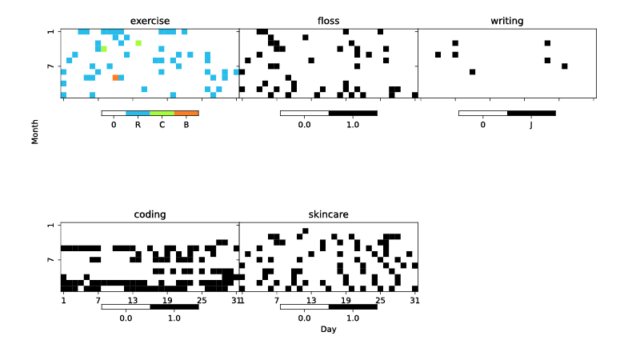

# Resolve CLI

Resolve is an open-source CLI app for people who make New Year's resolutions[^1] and intend to keep them. I decided to develop this tool after six years of using spreadsheets to track habits that I wanted to adopt.

You're welcome to fork and clone this repo to your heart's content. If you've found value in my work, please consider [buying me a coffee](https://ko-fi.com/snickerdoodle_studio).

## Features
### Core Features
#### Add and Log Resolutions

#### Graph Resolutions
Generate heatmaps from your data across multiple years and resolutions.

Heatmaps are temporarily stored as PDFs in `data/exports` and saved over the next time you graph.

* Overlay event labels on your graph, such as to mark days when you're traveling (see [example](data/trips.json)).

* Generate minimaps of individual resolutions. 

#### Export Data
Export your data (stored [locally](data/resolutions.json) as JSON) as a CSV file. Exported CSVs reside in `data/exports`).

### Standalone Scripts
#### Convert Legacy Data for Graphing
If you used to keep track of your resolutions in a spreadsheet (or you want to keep using a spreadsheet) but now want to import and visualize them in Resolve, you can use `convert_legacy_resolutions.py` ([location](scripts/convert_legacy_resolutions.py)).
##### Instructions
1. Save legacy spreadsheet as a CSV file under `data/legacy` (here's my [actual data from 2022](data/legacy/nyr22.csv)). In order for the conversion script to work, your data must meet the following assumptions:
   - Must have a date field under the column header of "Date" or "date"
   - Date field must be in MM/DD/YYYY format
   - Must contain columns with headers that refer to resolutions (such as "exercise")
   - Each row must correspond to a unique date, as well as contain data pertaining to whether and how a resolution was met on that date
2. Run `python convert_legacy_resolutions.py {filename}.csv` from the `scripts` folder. The output is a cleaned CSV saved to `data/cleaned` which can then be used for graphing.
3. Run the CLI tool and export graph from file.

#### Backpopulate App with Legacy Data
You may want to import some or all of your legacy data into the app if you are ditching spreadsheets altogether or wish to generate graphs spanning multiple years.
##### Instructions
1. Follow the steps above to Convert Legacy Data for Graphing. This will generate a clean and standardized CSV in the `data/cleaned` folder, which can then be used to backpopulate the application data stored locally in `data/resolutions.json`.
2. Run `python backpopulate_data.py {filename}.csv` in the `scripts` folder and follow the instructions.

## Getting Started
1. Install `pipenv` for package management if you don't already have it ([instructions](https://pipenv.pypa.io/en/latest/))
2. Clone the repo to your local machine and navigate into the `cli-resolve` directory
3. Install all dependencies: `pipenv install`
4. Run the program: `pipenv run python cli_resolve`

## Imaginary FAQs
### Is it really that hard to use a spreadsheet?
No, but sometimes you just gotta let a gal overengineer.

Also, you can schedule a cron job to run this program or host it in the cloud to automatically run once a day.

### Shouldn't this really be a web/desktop/mobile app?
### It would be useful to have features X, Y, and Z.
### Thing A, B, and C could do with a bit of refactoring.
Probably, possibly, and most definitely!

I do have it somewhere on my backlog to turn this into a more accessible GUI app (with additional features), but I'm just one person and my backlog never shrinks. The magic of open-source is that you're welcome to contribute, though!

### How do I get in touch with you?

Feel free to shoot me an [email](mailto:snickerdoodle.studio@gmail.com) if you have any questions or are interested in collaborating.

[^1]: Or, indeed, at any time of the year.